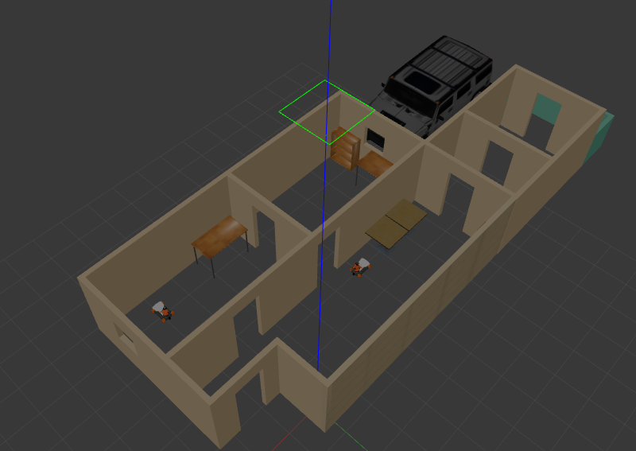

# Gazebo simulation environment


## Overview
This repo is inspired by the official tutorials on the gazebo website, mainly [model editor](http://gazebosim.org/tutorials?tut=guided_b3), and [world plugin](http://gazebosim.org/tutorials?tut=plugins_hello_world&cat=write_plugin) considering the following structure of gazebo components.
gazebo environment has:
1. Models of myhouse and wheeled robot.
2. World that integrates all the components.
3. Plugin that runs when the world is started.

## Clone and compile the repo  
```
git clone https://github.com/Robotawi/gazebo_env.git
cd gazebo_env
mkdir build && cd build
cmake .. 
make
```

## Run the simulation with the plugin
```
cd ../world
gazebo myhouseingazebowithrobot.sdf
```
If no required libraries are missing, gazebo loads and the following message is printed to console
```
The plugin is successfully loaded in simulation env.
```

This repo is to be extended according to gazebo [tutorials](http://gazebosim.org/tutorials).